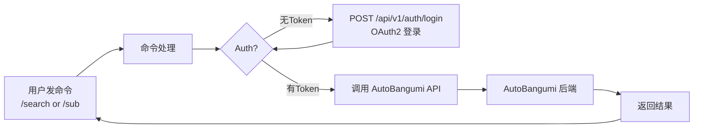

<div align="center">

# astrbot_plugin_autobangumi_command

**AutoBangumi 遥控器 — 聊天就能追番**

在 QQ / Telegram / 微信里发命令，直接操控 AutoBangumi 搜索番剧、订阅 RSS、管理追番

[]()
[](LICENSE)
[](https://github.com/AstrBotDevs/AstrBot)
[](https://github.com/EstrellaXD/Auto_Bangumi)

[命令](#命令) · [快速开始](#快速开始) · [配置](#配置) · [架构](#架构) · [排障](#常见问题)

</div>

---

> **前置依赖**：本插件是 [AstrBot](https://github.com/AstrBotDevs/AstrBot) 的插件，需要配合 [AutoBangumi](https://github.com/EstrellaXD/Auto_Bangumi) 使用。请确保 AutoBangumi 已部署并可访问。

## 命令

| 命令 | 用法 | 说明 |
|------|------|------|
| `/search` | `/search 鬼灭之刃` | 在 Mikan 搜索番剧，返回前 10 条结果 |
| `/sub` | `/sub <Mikan RSS URL>` | 添加 RSS 订阅，自动开始追番 |
| `/list` | `/list` | 查看当前所有订阅，含 ID 和状态 |
| `/delete` | `/delete <ID>` | 删除指定 ID 的订阅 |

典型使用流程：

```
/search 芙莉莲                              ← 先搜番
/sub https://mikanani.me/RSS/...             ← 找到后复制 RSS 地址订阅
/list                                        ← 查看已订阅
/delete 3                                    ← 不追了？删掉
```

## 快速开始

### 1. 安装

将插件放入 AstrBot 插件目录：

```
<AstrBot 数据目录>/data/plugins/astrbot_plugin_autobangumi_command/
```

重启 AstrBot 或在 WebUI 插件管理中启用。

### 2. 配置

打开 AstrBot WebUI → 插件设置 → `astrbot_plugin_autobangumi_command`：

| 配置项 | 默认值 | 说明 |
|--------|--------|------|
| `ab_url` | `http://127.0.0.1:7892` | AutoBangumi 的访问地址 |
| `ab_username` | `admin` | AutoBangumi 登录用户名 |
| `ab_password` | 空 | AutoBangumi 登录密码 |

填好密码保存，插件会自动登录并获取 Token。

### 3. 使用

在聊天中发送命令即可。插件连接 AutoBangumi 成功后会打印日志，失败则会在首次命令调用时报错。

## 配置

| 配置项 | 类型 | 默认值 | 说明 |
|--------|------|--------|------|
| `ab_url` | string | `http://127.0.0.1:7892` | AutoBangumi 地址，不含尾部斜杠 |
| `ab_username` | string | `admin` | 登录用户名 |
| `ab_password` | string | 空 | 登录密码 |

> AutoBangumi 默认端口为 7892。如果 AstrBot 和 AutoBangumi 在同一台 Docker 宿主机上，可能需要用宿主机 IP 而非 `127.0.0.1`。

## 架构

### 工作流程



### 模块结构

| 模块 | 职责 |
|------|------|
| `main.py` | 插件入口，4 个命令处理器 |
| `ab_client.py` | AutoBangumi REST API 客户端，OAuth2 认证 + auto-refresh |

## 常见问题

### 连接失败 / 认证失败

1. 检查 `ab_url` 是否正确——AstrBot 能否 ping 到 AutoBangumi
2. 确认用户名密码正确——可在浏览器访问 `http://<IP>:7892` 用同账号登录验证
3. 看 AstrBot 日志确认具体错误信息

### 搜索无结果

- AutoBangumi 的搜索基于 Mikan Project，确保 Mikan 可访问
- 尝试用更简短的关键词，或用日文名

### 添加 RSS 失败

- 确认 URL 是完整的 Mikan RSS 地址，类似 `https://mikanani.me/RSS/MyBangumi/...`
- 确认该 RSS 没有被重复添加

---

## 推荐搭配

| 插件 | 说明 |
|------|------|
| [AutoBangumi](https://github.com/EstrellaXD/Auto_Bangumi) | 全自动追番工具，本插件通过其 API 操控 |
| [astrbot_plugin_autobangumi_notify](https://github.com/Yometenma/astrbot_plugin_autobangumi_notify) | **通知转发**——新番更新自动推送到聊天 |
| [NapCat](https://github.com/NapNeko/NapCatQQ) | QQ 机器人框架，与 AstrBot 搭配使用 |

三者配合：遥控器负责「加追什么」，通知负责「告诉你更新了」，AutoBangumi 在后台默默干活。

## 许可

MIT © yometenma
