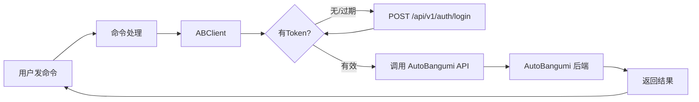
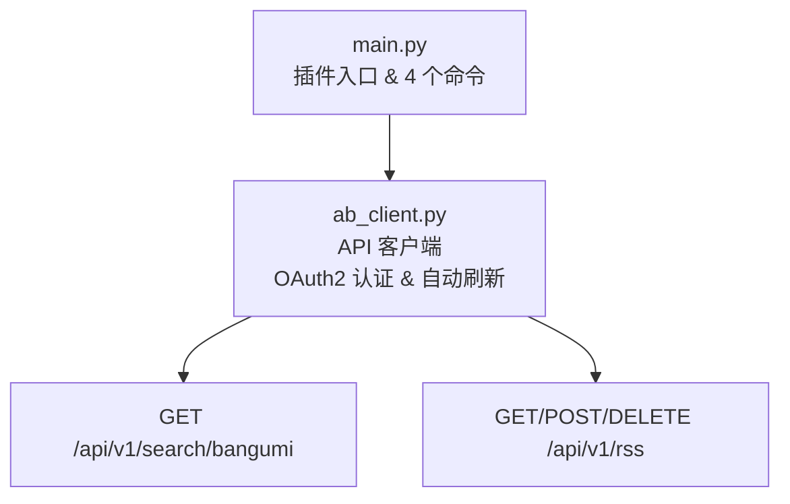

<div align="center">

# astrbot_plugin_autobangumi_command

**AutoBangumi 遥控器 — 聊天就能追番**

在 QQ / Telegram / 微信里发命令，直接操控 AutoBangumi 搜索番剧、订阅 RSS、管理追番

[]()
[](LICENSE)
[](https://github.com/AstrBotDevs/AstrBot)
[](https://github.com/EstrellaXD/Auto_Bangumi)

[功能](#功能) · [命令](#命令) · [快速开始](#快速开始) · [配置](#配置) · [架构](#架构) · [测试](#测试) · [排障](#常见问题)

</div>

---

> **前置依赖**：本插件是 [AstrBot](https://github.com/AstrBotDevs/AstrBot) 的插件，需要配合 [AutoBangumi](https://github.com/EstrellaXD/Auto_Bangumi) 使用。插件通过 AutoBangumi 的 REST API 进行操控，请确保 AutoBangumi 已部署且 API 端口（默认 7892）可被 AstrBot 访问。

## 功能

| 功能 | 说明 |
|------|------|
| 🔍 搜索番剧 | `/search` 在 Mikan 搜索番剧，返回匹配结果 |
| ➕ 添加订阅 |  `/sub <url> [名称]`一键添加 Mikan RSS 订阅，即刻开始追番 |
| 📋 订阅列表 | `/list` 查看当前所有订阅，含 ID、名称、启用状态 |
| 🗑 删除订阅 | `/delete` 按 ID 删除，不追了随时停 |
| 🔐 自动认证 | OAuth2 自动登录，Token 过期自动刷新，无需手动管理 |
| 🎭 人格回复 | 所有命令回复经 LLM 以 AstrBot 自身人格转述，也可关闭用原文 |

## 命令

| 命令 | 用法 | 说明 |
|------|------|------|
| `/search` | `/search 鬼灭之刃` | 在 Mikan 搜索番剧，返回前 10 条结果 |
|  `/sub <url> [名称]`|  `/sub <Mikan URL> [名称]` | 添加 RSS 订阅。筛选、正则等详细配置需在 AutoBangumi WebUI 完成 |
| `/list` | `/list` | 查看当前所有订阅，含 ID 和启用状态 |
| `/delete` | `/delete <ID>` | 删除指定 ID 的订阅 |

典型使用流程：

```
/search 芙莉莲                              ← 先搜番
/sub https://mikanani.me/RSS/... 鬼灭之刃    ← URL + 名称
/list                                        ← 确认已添加
/delete 3                                    ← 不追了？删掉
```

## 快速开始

### 1. 安装

```bash
cd <AstrBot 数据目录>/data/plugins
git clone https://github.com/Yometenma/astrbot_plugin_autobangumi_command.git
```


重启 AstrBot 或在 WebUI 插件管理中启用。

### 2. 配置

打开 AstrBot WebUI → 插件设置 → `astrbot_plugin_autobangumi_command`：

| 配置项 | 默认值 | 说明 |
|--------|--------|------|
| `ab_url` | `http://127.0.0.1:7892` | AutoBangumi 的访问地址 |
| `ab_username` | `admin` | AutoBangumi 登录用户名 |
| `ab_password` | 空 | AutoBangumi 登录密码 |

填好密码保存，插件启动时会自动登录获取 Token。

> **注意**：如果 AstrBot 和 AutoBangumi 在同一台 Docker 宿主机上，`127.0.0.1` 指向的是各自容器内部，需要用宿主机 IP 或容器名。

### 3. AutoBangumi 侧确认

无需额外配置——只要 AutoBangumi 正常运行且 API 端口可访问即可。可在浏览器访问 `http://<IP>:7892` 验证。

## 配置

| 配置项 | 类型 | 默认值 | 说明 |
|--------|------|--------|------|
| `ab_url` | string | `http://127.0.0.1:7892` | AutoBangumi 地址，不含尾部斜杠 |
| `ab_username` | string | `admin` | 登录用户名 |
| `ab_password` | string | 空 | 登录密码 |
| `use_llm` | bool | `true` | 是否用 LLM 以机器人口吻回复。关掉则返回原始文本 |

> Token 由插件自动管理——登录成功后缓存，401 时自动重新登录刷新。

## 架构

### 工作流程



### 模块结构



## 测试

### 连接测试

启动插件后查看 AstrBot 日志，应看到：

```
已连接 AutoBangumi: http://192.168.1.20:7892
```

若看到连接失败，检查 `ab_url` 和账号密码。

### 命令测试

在聊天中发送：

```
/search 测试
/list
```

搜索应返回结果，列表应显示当前订阅（可能为空）。

## 常见问题

### 连接失败 / 认证失败

1. 检查 `ab_url`——能否在浏览器访问 `http://<IP>:7892`
2. 确认用户名密码正确——用同账号登录 WebUI 验证
3. Docker 环境确认网络互通（`127.0.0.1` 指向容器自身，不是宿主机）
4. 查看 AstrBot 日志确认具体错误

### 搜索无结果

- AutoBangumi 搜索基于 Mikan Project，确保 Mikan 可访问
- 尝试更简短的关键词，或用日文名

### 添加 RSS 失败

- 确认 URL 是完整的 Mikan RSS 地址（`https://mikanani.me/RSS/...`）
- 确认没有被重复添加

---

## 推荐搭配

| 插件 | 说明 |
|------|------|
| [AutoBangumi](https://github.com/EstrellaXD/Auto_Bangumi) | 全自动追番工具，本插件通过其 API 操控 |
| [astrbot_plugin_autobangumi_notify](https://github.com/Yometenma/astrbot_plugin_autobangumi_notify) | **通知转发**——新番更新自动推送到聊天 |
| [NapCat](https://github.com/NapNeko/NapCatQQ) | QQ 机器人框架，与 AstrBot 搭配使用 |

三者配合：遥控器负责「加追什么」，通知负责「告诉你更新了」，AutoBangumi 在后台默默干活。

## 许可

MIT © yometenma
